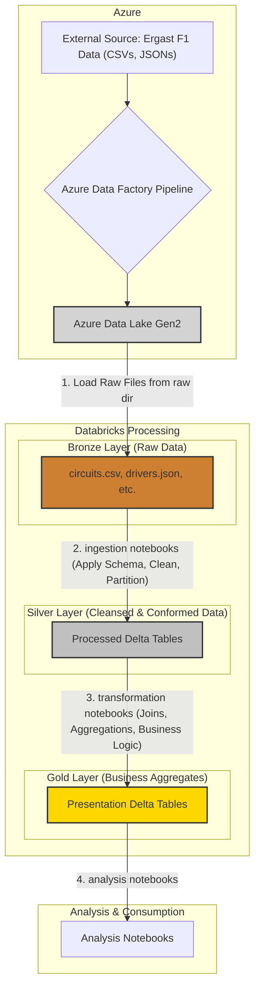
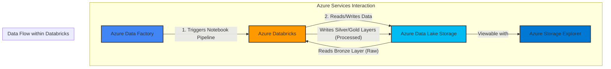
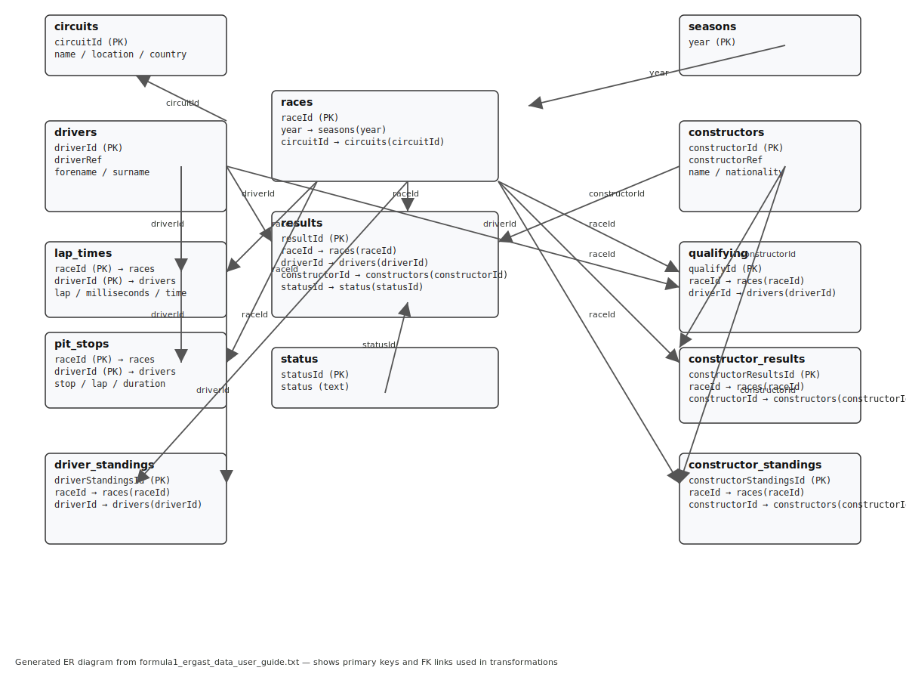

# 🏁 F1 Ingestion — Formula 1 ELT Platform

An end-to-end Formula 1 data ingestion, processing and analysis platform built on Azure and Databricks. It ingests Ergast F1 datasets (CSV/JSON), loads them into cloud storage, and transforms them using Databricks notebooks and Spark to produce analytical-ready tables.

---

## 🧭 Quick Summary

- **Project:** F1 ingestion (Ergast) — ingest, validate, transform, present
- **Approach:** ELT with Medallion Architecture (Bronze → Silver → Gold)
- **Primary Tech:** Azure Data Explorer, Azure Data Factory, Azure Data Lake, Databricks, Delta Lake, Spark, Python, SQL, Jupyter Notebooks, Airflow (orchestration option), Parquet/Delta

---

## 🛠️ Tech Stack (at-a-glance)

| Icon | Technology                            | Role                                                       |
| :--- | :------------------------------------ | :--------------------------------------------------------- |
| ☁️   | **Azure**                             | Cloud platform (storage, compute, orchestration)           |
| 🔎   | **Azure Data Explorer**               | Source ingestion / exploration of Ergast data              |
| 🔁   | **Azure Data Factory (ADF)**          | Orchestration: triggers Databricks notebooks and pipelines |
| 🧰   | **Databricks (Spark)**                | Data processing, transformations, notebooks                |
| 🗄️   | **ADLS (raw/processed/presentation)** | Stores Bronze/Silver/Gold layers                           |
| 🔐   | **Azure Key Vault**                   | Secrets / PATs / service principal credentials             |
| 🐍   | **Python + Spark SQL**                | Notebook code and transformations                          |
| 📓   | **Jupyter / Databricks Notebooks**    | Development / notebooks in `notebook/`                     |
| 📄   | **CSV / JSON**                        | Source raw file formats in `raw/`                          |
| ⚡   | **Delta / Parquet**                   | Columnar storage for processed datasets (Silver/Gold)      |
| 🧭   | **Airflow (optional)**                | Alternative orchestration option (project-compatible)      |

---

**Is this ETL, ELT or Hybrid?**

This repository implements a modern ELT pattern: source files are loaded into the Bronze/raw layer, and transformations (cleaning, schema enforcement, joins and aggregation) are executed in Databricks to produce Silver and Gold tables. Orchestration is handled by ADF. Because orchestration and some validation are also performed in ADF plus Databricks handles heavy transforms, this can be considered ELT (with hybrid orchestration responsibilities).

---

**Important project files:** [formula1_ergast_data_user_guide.txt](formula1_ergast_data_user_guide.txt) (schema & data guide), snapshots & ADF pipeline JSONs in `snaps/`.

---

## 🏛️ Architecture & Workflow (Overview)

### Medallion Architecture Workflow

The entire pipeline is structured around the Medallion Architecture, which logically organizes data into three distinct layers: Bronze, Silver, and Gold. This ensures data quality, traceability, and reusability.

### High-Level Service Interaction

The following diagram illustrates the roles of the key Azure services and how they interact:

Where each step does:

- Bronze → Silver: schema application, type casting, null handling, partitioning, write as Delta.
- Silver → Gold: join multiple silver tables, compute business metrics (race results, standings), window functions, final partitioning.

---

## 🔎 Ingestion & Orchestration (ADF + Notebooks)

Flow executed by ADF pipelines (JSONs in `snaps/`):

1. ADF pipeline triggers Databricks notebook(s) with a PAT / service principal credential stored in Key Vault.
2. Databricks runs `notebook/ingestion/*` notebooks to ingest each raw file into Silver Delta tables.
3. Validation checks (row counts, schema, sample checks) run in notebooks to ensure data quality.
4. Transformation notebooks are triggered to assemble Gold presentation tables.

ADF artifacts and pipeline definitions (see `snaps/`):

- `ADF_pl_ingest_formula1_data.json` — ingestion pipeline definition
- `pl_process_formula1_data_2.json` — transformation pipeline example

For lineage: review the pipeline screenshots and JSONs in `snaps/` to see the step ordering and debug run traces.

---

## 🧩 Databricks: Setup, Ingestion, Transformation, Analysis

Where to look in the repo:

- Setup and access experiments: [notebook/setup](notebook/setup)
- Ingestion notebooks: [notebook/ingestion](notebook/ingestion)
- Reusable helpers: [notebook/includes](notebook/includes)
- Demos & learning notebooks: [notebook/demo](notebook/demo)
- Transformations (Gold): [notebook/transformation](notebook/transformation)
- Analysis notebooks: [notebook/analysis](notebook/analysis)

Highlights:

- The `setup` notebooks implement multiple authentication patterns (access key, SAS token, service principal, cluster scope, and mounting to DBFS). The repository documents these experiments; production uses service principal + Key Vault for automation.
- The ingestion notebooks apply structured schemas (see `formula1_ergast_data_user_guide.txt`) and write partitioned Delta tables in the `processed` container.
- A `common_functions.ipynb` contains shared helpers (add metadata columns, incremental merge logic, status tracking) used across ingestion notebooks.
- Transformations use Spark SQL and Python to create final presentation tables (race results, driver standings etc.) with window functions and business rules.

Delta adoption:

- The repo originally used Hive metastore style tables; it now favors Delta tables for ACID guarantees and reliable incremental processing.

---

## 📂 Raw Data: understanding relationships

The included `raw/` folder contains CSV and JSON files with the Ergast dataset entities: `circuits.csv`, `races.csv`, `drivers.json`, `constructors.json`, `results.json`, `pit_stops.json`, and split lap_times/ and qualifying/ files.

Refer to the schema document: [formula1_ergast_data_user_guide.txt](formula1_ergast_data_user_guide.txt) and the entity relationship diagram (if present) to map keys and foreign relationships (raceId, driverId, constructorId, circuitId, etc.).

Typical relationships:

- races ← results (raceId)
- drivers ← results (driverId)
- constructors ← results (constructorId)
- circuits ← races (circuitId)

Use these to design joins and denormalized Gold tables.

### Entity Relationship Diagram

Below is the ER diagram derived from `formula1_ergast_data_user_guide.txt` showing primary keys and foreign-key relationships used throughout ingestion and transformation steps.

---

## 🔐 Azure Resources Provisioned (what's been created)

- Azure Resource Group — logical grouping
- Azure Storage Account / ADLS Gen2 — containers: `raw`, `processed`, `presentation`
- Azure Key Vault — stores secrets, ADF and Databricks credentials
- Azure Databricks Workspace — notebooks and clusters
- Azure Data Factory — pipeline orchestration and triggers
- Cost management profile set up for monitoring (free account)

---

## 🔁 ADF + Databricks Authentication & Execution

- Databricks PATs are stored securely in Key Vault and used by ADF to trigger notebooks.
- Service principal credentials are used to mount or access ADLS where appropriate.
- Notebooks are invoked by ADF with parameters (e.g., file paths, target table names) to allow parametric runs.

---

## ✅ How to explore & reproduce the pipeline (quick start)

1. Review the data model and schema: [formula1_ergast_data_user_guide.txt](formula1_ergast_data_user_guide.txt).
2. Inspect raw files in `raw/` to confirm formats and any anomalies.
3. Open `notebook/setup` in Databricks and follow the authentication notebook to ensure Databricks has access to the ADLS containers.
4. Run ingestion notebooks from `notebook/ingestion` in this order (or trigger via ADF): circuits → constructors → drivers → races → results → pit_stops → lap_times → qualifying.
5. Confirm Silver tables exist in ADLS `processed` and run validation queries.
6. Trigger `notebook/transformation` to build Gold presentation tables and then run `notebook/analysis` for sample analytics.

Local notes:

- Notebooks are primarily authored for Databricks; to run locally you can spin up a small cluster or use a local Spark environment, but secrets and mounts will differ.

---

## 🔬 Key Design & Engineering Decisions

- ELT with Medallion architecture: simpler flow, compute on Databricks for transformations, storage-backed Bronze layer for raw recovery.
- Delta Lake adoption for ACID, enabling safe upserts and incremental merges.
- ADF for orchestration (visual tooling + monitoring), with notebooks handling heavy compute.
- Centralized reusable helpers in `notebook/includes` to decrease duplication.

---

## 🧾 Artifacts & Where to Look (repo map)

- Notebook setup & auth: [notebook/setup](notebook/setup)
- Ingestion: [notebook/ingestion](notebook/ingestion)
- Transformation: [notebook/transformation](notebook/transformation)
- Analysis: [notebook/analysis](notebook/analysis)
- Reusable helpers: [notebook/includes](notebook/includes)
- Demos / learning notebooks: [notebook/demo](notebook/demo)
- Raw data: [raw/](raw)
- ADF pipeline JSON and snapshots: [snaps/](snaps)
- Data schema guide: [formula1_ergast_data_user_guide.txt](formula1_ergast_data_user_guide.txt)

Databricks is the core of this project, where all data manipulation occurs. The work is logically separated into the following notebook directories:

- 📂 **`notebook/setup`**: This directory contains notebooks dedicated to establishing a secure connection between Azure Databricks and Azure Data Lake Storage. It explores various authentication methods (access keys, SAS tokens) and ultimately implements a robust solution using a Service Principal to mount the ADLS containers to DBFS. This is the crucial first step for the project.

- 📂 **`notebook/ingestion`**: These notebooks handle the ELT process from the Bronze to the Silver layer. Each notebook is responsible for a specific raw file (e.g., `1. ingest_circuits_file.ipynb`). They read the source data, apply the correct schema, perform necessary cleaning and data type conversions, and write the output as a partitioned Delta table to the `processed` container.

- 📂 **`notebook/transformation`**: Here, the Silver data is elevated to Gold. These notebooks perform the heavy lifting of joining multiple Silver tables to create denormalized, aggregated datasets ready for business intelligence. For example, `1. race_results.ipynb` joins races, drivers, and results data, while `2. driver_standings.ipynb` calculates championship points using window functions.

- 📂 **`notebook/analysis`**: This is the final step, where the clean, aggregated Gold-layer data is queried to produce insights. Notebooks like `0. dominant_drivers.ipynb` demonstrate how easily an analyst can now query the presentation tables to answer complex questions.

- 📂 **`notebook/includes`**: A centralized location for reusable code. `common_functions.ipynb` contains helper functions (e.g., adding an ingestion date column) that are called from multiple ingestion notebooks, promoting code reuse and consistency.

- 📂 **`notebook/demo`**: A collection of experimental and learning notebooks. These were used to explore various Spark functionalities like joins, aggregations, and temporary views before implementing them in the main pipeline.

Initially, the project used the standard Databricks Hive metastore, but it was later migrated to use **Delta Lake** tables directly. This switch provides critical **ACID transaction** capabilities, ensuring data reliability and consistency, especially in incremental loading scenarios.

---

## 📈 Example transformation roadmap (actionable)

1. Confirm Bronze ingestion: ensure all raw files are present in `raw/`.
2. Run `1. ingest_circuits_file.ipynb` — create `circuits` Delta table (Silver).
3. Repeat for drivers, constructors, races, results, pit_stops, lap_times, qualifying.
4. Run `1. race_results.ipynb` (transformation) to produce `race_results` Gold table.
5. Run `2. driver_standings.ipynb` to compute aggregated standings.
6. Use `notebook/analysis/0. dominant_drivers.ipynb` to validate insights and visualizations.

---

## 🧪 How data quality is ensured

- Schema enforcement in ingestion notebooks.
- Row-count and sample checks after ingestion.
- Upsert/merge logic for incremental loads using Delta merges (idempotent behavior).
- Simple assertions / unit checks in notebooks (e.g., no missing raceId in results) before transforming to Gold.

---

## 🗂️ Tips for contributors

- Follow the notebook ordering for ingestion.
- Use `notebook/includes/common_functions.ipynb` for utilities instead of copying code.
- When adding new raw sources, create a matching ingestion notebook and add it to the ADF pipeline definition (snaps JSON).

---

## 🏁 Next steps / improvements

- Add automated unit tests for notebook logic with `pytest` + `papermill` or `nbval`.
- Add CI to validate notebook runs (`papermill` for parameterized runs) before merging changes.
- Add observability: table-level metrics, row counts and drift checks integrated into ADF or Databricks jobs.
- Consider adding an Airflow DAG equivalent for orchestrating notebooks if ADF is not available in other environments.

---
